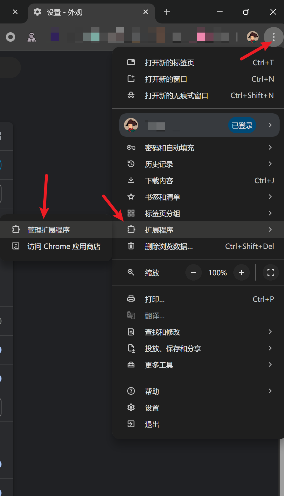
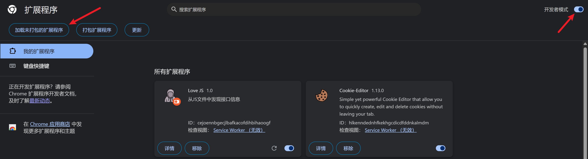
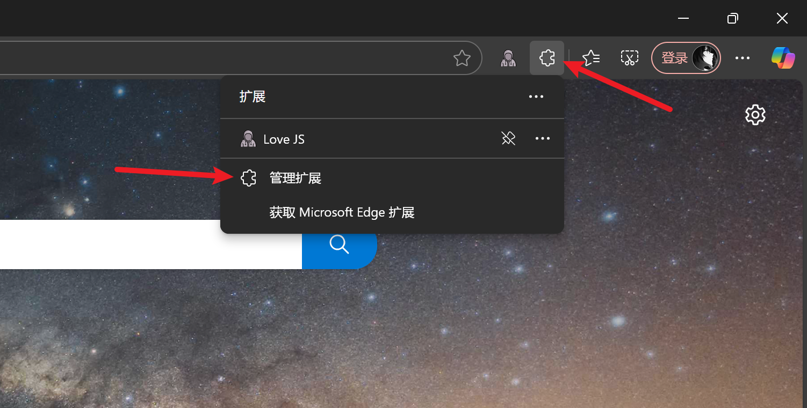
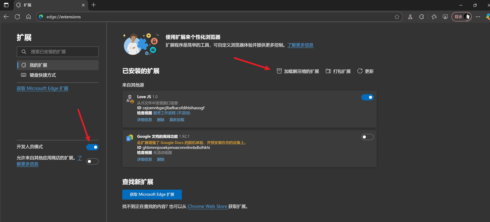
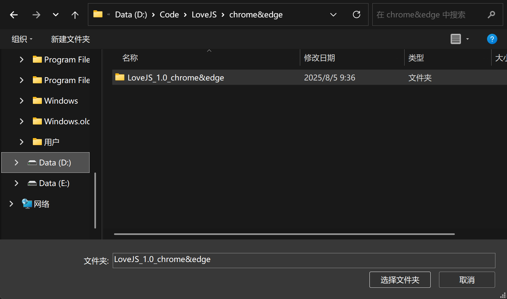
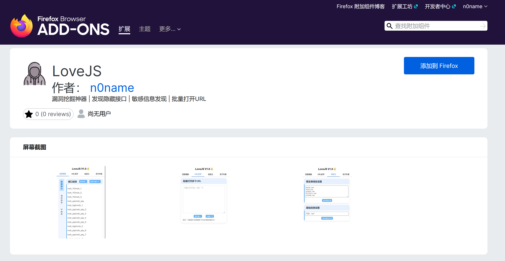
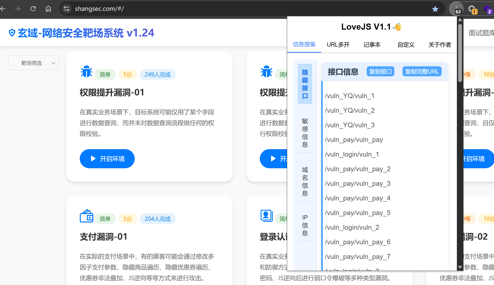
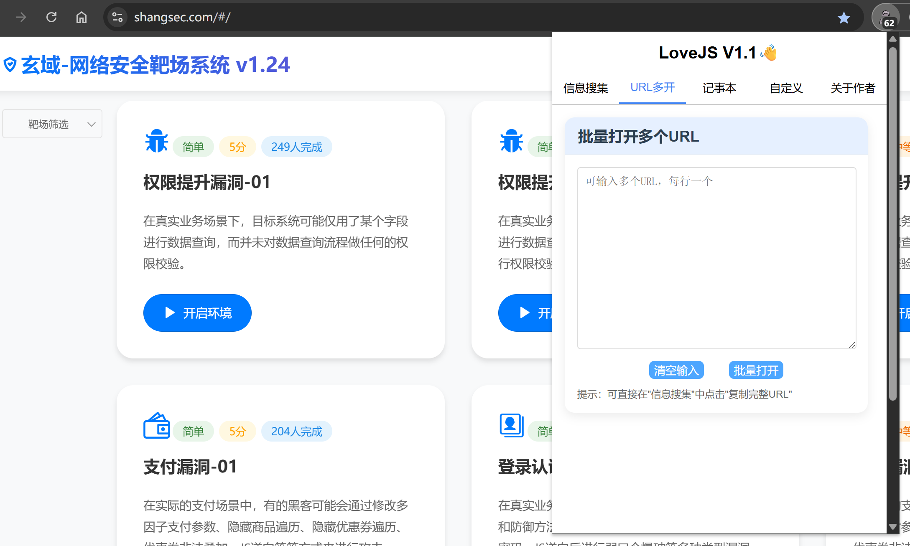
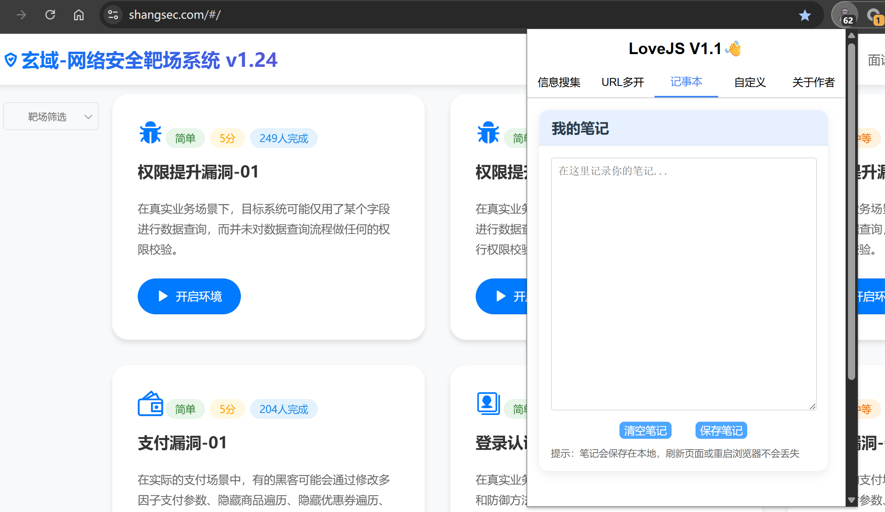
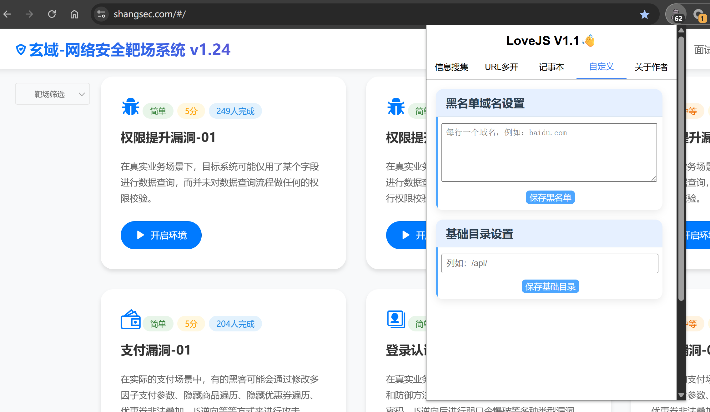

  
  

# 一、LoveJS 简介

**LoveJS** 是一款帮助网络安全研究员获取页面和JS中的隐藏接口和敏感信息的浏览器插件，并且可以批量打开URL和自定义基础目录，可以帮助用户高效的进行API接口测试和漏洞挖掘

同时支持 **Chrome**、**Firefox**、**Edge** 浏览器

&nbsp;

# 二、安装部署

把插件压缩包下载到本地后，进行解压，建议把解压后的文件夹放入熟悉的路径以免误删

## Chrome

1、点击进入"管理扩展程序"

2、打开 "开发者模式" 后点击 "加载未打包的扩展程序"

3、选择解压后的文件夹即可

## Edge

1、点击 "管理扩展"

2、点击 "开发人员模式" 然后点击 "加载解压缩的扩展"

3、选择解压后的文件夹即可

## Firefox

由于火狐官方的要求，正式版插件无法本地安装，直接在火狐的插件商店搜索 "LoveJS" 即可

火狐浏览器打开：https://addons.mozilla.org/zh-CN/firefox/addon/lovejs/（还在审核中...）

&nbsp;

# 三、工具使用

## 信息搜集

复制接口：仅复制当前展示的接口信息

复制完整URL：把当前域名和接口进行拼接后的结果（可以自定义基础目录从而更加高效的测试）

敏感信息：搜集页面和JS中的邮箱、手机号、云key等信息

## 批量打开URL

批量打开多个URL，但是不建议一次性打开太多，根据自身电脑配置适当

可以把 "复制完整URL" 的结果直接粘贴在这里（推荐先把复制后的信息粘贴到记事本中，再分批批量打开）

## 记事本

可记录渗透测试过程中一些信息，方便后续的测试，以及结合URL批量打开，避免一次性打开大量URL造成卡顿

笔记会保存在本地，刷新页面或重启浏览器不会丢失

## 自定义基础目录和域名黑名单

自定义基础目录：例如填写 /api/ 后，再去 "复制完整URL"，原本的 http://www.baidu.com/test?id=1 就会变成 http://www.baidu.com/api/test?id=1

域名黑名单：访问在黑名单中的域名将不做任何处理

&nbsp;

# 四、下个版本计划

- [ ] 优化用户交互体验
- [ ] 修复已知BUG

